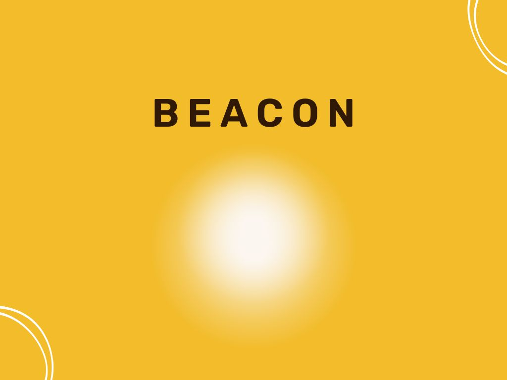

With Beacon, we're exploring a concept for living that understands what you need and caters to you with ease. We're combining the smarts of a smart home with you at the centre of it all. All you need to do is to share your preferences of how you'd like things to be at home — whether it's lighting, sound, or other impediments — and we'll make sure you'll feel safe at home, even with other people around.

## Inspiration

With this hackathon, we wanted to expand our experience in making things. We wanted to dive into topics we found interesting and had potential holes we could further explore. Choosing the topic _Inclusivity & Accessibility Tech_, we thought that it would be exciting to zoom into the daily experience of a person with disabilities and see what we can do to make it better for them.

## Tools and Frameworks

We tried our best to make full use of the things given to us during the hackathon, so we experimented with different ideas and technologies to implement our final idea. The MVP we made includes:

- A basic hardware circuit powered by an ESP32-S3-DevKitC-1 that mimics the behaviour of the solution in a house.
- A back-end service written with Flask that facilitates communication between the hardware circuit and other systems.
- A facial recognition system with OpenCV to recognise faces and associate preferences with them.

## Challenges

We'll always find something to struggle with when making things with tech, and in this hackathon, it's having to learn how to use ESP32s from scratch! We had wanted to take part in the workshops that were held before the event that guides participants towards Arduino and ESP32 development; we think that not taking part in it greatly reduced our productivity during the day-of itself.

## What We've Learnt

The fireside chats during the hackathon were greatly insightful and interesting to us; we now know much more about the four different themes that the hackathon surrounds. Despite being big ideas that are challenging with no one-size-fits-all solutions or silver bullets, we can still try to do something, especially by innovating, to spark some change.

## What's Next?

There are so many ideas that we wanted to combine with Beacon to make it much more of a solution for inclusiveness and accessibility that we couldn't because of time constraints. Here are some of them:

- Supporting gestural and vocal recognition alongside facial recognition to complement different types of disabilities
- Planning and creating a comprehensive solution that also involves caregivers
- Using machine learning more, like using predictive analytics to learn a person's preferences instead of asking them to set up

## Licence

This repository is made open-source with the [MIT License](https://github.com/pikanotjx/sutdwasdoftime/blob/main/LICENSE.md), meaning that you are allowed to modify and distribute the source code as well as use it for private and commercial use provided that the licence and copyright notices are retained. For more information, visit the link above to learn what is permitted by the licence.
